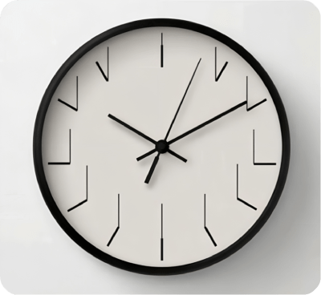
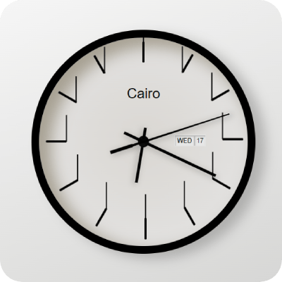

# Wall Clock

Wall Clock is a live Clock frontend interface.

## Live Link
[Live Wall Clock](https://abdulrahmanhatem.github.io/wall-clock/)

## Description 
Welcome abroad fellow developer, here you will find the details of my wall clock project story.

###  Motivation 
When I saw this beautiful minimalist clock design , I encouraged myself to implement it with ***HTML, CSS and Javascript***.

Here is the Design 

And result would be something like 

### What are the technologies you will use ? 
 ***HTML***&ensp;
 ***CSS***&ensp; ***Javascript***         

### Why wall clock project ?

To improve developer's skills in writing scripts and enhance CSS skills for better UI

### What problem does clock project solve?

It provides a nice looking design for a live real time clock.

### What did you learn?
As a frontend developer I put my HTML, CSS and Javascript skills in practice and learn new things about client ***built-in internationalization date time format and zone apis***.

##   Features
 - Showing user real ***time*** within one's zone.
 - Showing user visiting from ***city***.
 - Showing user real ***day date and day name***.
 - Simulate a real life ***clock movement*** mechanism.
 - Simulating a real life ***clock tick sound***.
 - Simulating a real life ***clock mignight 12 a.m. Sound***.
 - Giving user option to ***turn on/off sound***.
 - Great ***Responsive design*** for all devices.
 - Static asset cache via service workers which means less http requess and less loading cost.  

##   Progressive Web Application Feature
Wall Clock is PWA which is has a progressive Web App Feature.
It can be installed from IOS and Android broswers and working normally as a regular native app.

Give it a try and install it on your device : 

[How to install PWA on Android](https://support.google.com/chrome/answer/9658361?hl=en&co=GENIE.Platform%3DDesktop)

[How to install PWA on IOS](https://www.bitcot.com/how-to-install-a-pwa-to-your-device/#Installing_a_PWA_on_iOS)

 ##  License
[MIT](https://opensource.org/license/mit)

